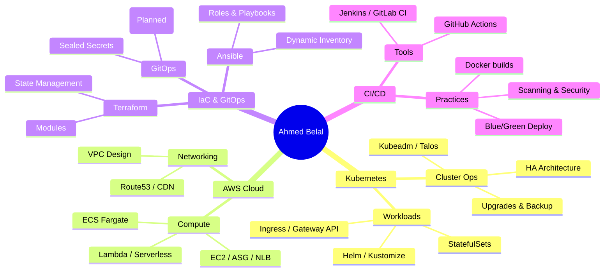

# ⚙️ DevOps & Cloud Portfolio

### **Ahmed Belal**
**Senior DevOps & Cloud Engineer**

[🌐 Website](https://www.cloudycode.dev) • [💼 LinkedIn](https://linkedin.com/in/engabelal) • [📧 Email](mailto:eng.abelal@gmail.com)

---

  
  

---

## 📌 About Me

> *From managing **enterprise data centers** to building **cloud platforms**—my journey has always been driven by a passion for **automation**. I constantly built **scripts and tools** to eliminate manual work and solve real problems. That's when I found **Cloud & DevOps**—where **infrastructure meets code**, and where I now build **automated, scalable systems** that just work.*

---

## 🗺️ Skill & Competency Map

---

## 🏗️ Project Catalogue

### ☸️ Kubernetes & Cloud Native
| Project | Tech Stack | Description |
|---------|------------|-------------|
| **[K8s GitOps Canary Showcase](https://github.com/engabelal/k8s-gitops-canary-showcase)** | K8s · ArgoCD · Gateway API · cert-manager | Production canary deployment with automated SSL |
| **[Ghost Blog Platform](https://github.com/engabelal/k8s-ghost-blog-platform)** | K8s · GitOps · Traefik · MySQL | Production self-hosted blog platform with GitOps |
| **[Kubeadm AWS Lab](https://github.com/engabelal/k8s-aws-kubeadm-tf)** | Terraform · AWS · Kubeadm | "Zero to Hero" K8s cluster from scratch on AWS |
| **[HA K8s Local](https://github.com/engabelal/k8s-ha-multipass)** | Multipass · HAProxy · Kubeadm | Local High-Availability Cluster with stacked etcd |
| **[HA K8s Talos](https://github.com/engabelal/k8s-ha-talos)** | Talos · Envoy Gateway · MetalLB | Immutable OS & Modern Gateway API Cluster |

### ☁️ AWS & Infrastructure as Code
| Project | Tech Stack | Description |
|---------|------------|-------------|
| **[ECS Fargate Blue/Green](https://github.com/engabelal/ecs-fargate-terraform-deployment)** | Terraform · ECS · CodeDeploy | Production-ready Blue/Green deployment pipeline |
| **[Terraform Layered Arch](https://github.com/engabelal/terraform-layered-mern-rds)** | Terraform · S3 Backend · RDS | Modular IaC architecture with isolated state |
| **[Web App on EC2 ASG](https://github.com/engabelal/simple-webapp-ec2-nlb-asg)** | Terraform · ASG · NLB | Scalable web infra with multi-AZ & load balancing |
| **[Serverless Events](https://github.com/engabelal/iac-aws-serverless-event)** | Lambda · DynamoDB · API GW | Full serverless backend for event registration |
| **[VMware Provisioning](https://github.com/engabelal/iac-vmware-tf-vmprov)** | Terraform · VMware · RHEL | Infrastructure as code for on-prem virtualization |

### 🤖 DevOps Automation & CI/CD
| Project | Tech Stack | Description |
|---------|------------|-------------|
| **[Cloudy Runner](https://github.com/engabelal/cloudy-runner)** | Docker · CI/CD · Multi-arch | Universal DevOps CI/CD Runner Image (All-in-one) |
| **[Node.js CI/CD Pipeline](https://github.com/engabelal/simple-nodejs-ec2-cicd)** | GitHub Actions · AWS SSM | Fast 13s deployment pipeline to EC2 |
| **[Ansible Dynamic Inv](https://github.com/engabelal/ansible-aws-inventory-demo)** | Ansible · AWS · Bastion | Automated inventory management via SSH tunnels |
| **[MERN Ansible Deploy](https://github.com/engabelal/cm-ansible-mern-stack)** | Ansible · MongoDB · Node.js | Automated full-stack application provisioning |
| **[Packer Golden AMI](https://github.com/engabelal/packer-aws-devops-ami)** | Packer · AWS · Ubuntu | Automated hardened image creation pipeline |
| **[Automation Scripts](https://github.com/engabelal/abcloudops-scripts-kit)** | Bash · AWS CLI | Essential DevOps toolkit for cloud management |

---

## 📁 Detailed Project Breakdown

### ☸️ Kubernetes & Cloud Native

#### ✅ [Kubernetes GitOps Canary Deployment Showcase](https://github.com/engabelal/k8s-gitops-canary-showcase)
- **Summary:** Production-ready canary deployment running on private VPS (Kubernetes v1.35) demonstrating progressive delivery with traffic splitting. Features ArgoCD ApplicationSet for automated deployments, Envoy Gateway API for intelligent routing (60/40 split), and cert-manager with Cloudflare DNS-01 challenge for automated SSL certificates. Live deployment at canary.cloudycode.dev with git tag-based versioning and real-time traffic distribution.
- `git clone https://github.com/engabelal/k8s-gitops-canary-showcase.git`

#### ✅ [Ghost Blog Platform on Kubernetes - Self Hosted](https://github.com/engabelal/k8s-ghost-blog-platform)
- **Summary:** Production-ready, secure, and scalable Ghost blogging platform...
  *(Check repo for full README)*
- `git clone https://github.com/engabelal/k8s-ghost-blog-platform.git`

#### ✅ [Kubeadm AWS Terraform Lab - Zero to Hero](https://github.com/engabelal/k8s-aws-kubeadm-tf)
- **Summary:** The ultimate "Zero to Hero" Kubernetes lab on AWS...
- `git clone https://github.com/engabelal/k8s-aws-kubeadm-tf.git`

#### ✅ [Kubernetes High-Availability Lab - Multipass](https://github.com/engabelal/k8s-ha-multipass)
- **Summary:** Fully automated local High-Availability Kubernetes cluster...
- `git clone https://github.com/engabelal/k8s-ha-multipass.git`

#### ✅ [Kubernetes HA on Talos Linux - Modern Gateway API](https://github.com/engabelal/k8s-ha-talos)
- **Summary:** Advanced next-generation Kubernetes cluster running on Talos Linux...
- `git clone https://github.com/engabelal/k8s-ha-talos.git`

---

### ☁️ AWS & Infrastructure as Code

#### ✅ [ECS Fargate Blue/Green Deployment](https://github.com/engabelal/ecs-fargate-terraform-deployment)
- **Summary:** Production-ready containerized application deployment using AWS ECS Fargate...
- `git clone https://github.com/engabelal/ecs-fargate-terraform-deployment.git`

#### ✅ [Terraform Layered Architecture](https://github.com/engabelal/terraform-layered-mern-rds)
- **Summary:** Production-grade layered Terraform architecture solving real-world infrastructure challenges...
- `git clone https://github.com/engabelal/terraform-layered-mern-rds.git`

#### ✅ [Simple Web App on AWS EC2 Auto Scaling](https://github.com/engabelal/simple-webapp-ec2-nlb-asg)
- **Summary:** Production-ready AWS infrastructure with EC2 Auto Scaling Groups...
- `git clone https://github.com/engabelal/simple-webapp-ec2-nlb-asg.git`

#### ✅ [Serverless Event Registration](https://github.com/engabelal/iac-aws-serverless-event)
- **Summary:** Infrastructure as Code project to provision a complete serverless application...
- `git clone https://github.com/engabelal/iac-aws-serverless-event.git`

#### ✅ [OpenText IAM & Patch Terraform - VMware](https://github.com/engabelal/iac-vmware-tf-vmprov)
- **Summary:** Terraform code for provisioning RHEL 9.4 VMs on VMware vSphere...
- `git clone https://github.com/engabelal/iac-vmware-tf-vmprov.git`

---

### 🤖 DevOps Automation & CI/CD

#### ✅ [Cloudy Runner - The Ultimate DevOps Image](https://github.com/engabelal/cloudy-runner)
- **Summary:** A production-ready, multi-architecture (AMD64/ARM64) Docker image...
- `git clone https://github.com/engabelal/cloudy-runner.git`

#### ✅ [Node.js CI/CD Pipeline to AWS EC2](https://github.com/engabelal/simple-nodejs-ec2-cicd)
- **Summary:** Production-ready CI/CD pipeline deploying Node.js applications to AWS EC2...
- `git clone https://github.com/engabelal/simple-nodejs-ec2-cicd.git`

#### ✅ [Ansible AWS Dynamic Inventory Demo](https://github.com/engabelal/ansible-aws-inventory-demo)
- **Summary:** Production-grade infrastructure automation using Ansible with AWS EC2 dynamic inventory...
- `git clone https://github.com/engabelal/ansible-aws-inventory-demo.git`

#### ✅ [Automated MERN Stack Deployment](https://github.com/engabelal/cm-ansible-mern-stack)
- **Summary:** Automated provisioning of a complete MERN stack (MongoDB, Express, React, Node.js)...
- `git clone https://github.com/engabelal/cm-ansible-mern-stack.git`

#### ✅ [Packer AWS DevOps Base AMI](https://github.com/engabelal/packer-aws-devops-ami)
- **Summary:** Automated Golden AMI creation using HashiCorp Packer...
- `git clone https://github.com/engabelal/packer-aws-devops-ami.git`

#### ✅ [ABCloudOps Scripts Kit](https://github.com/engabelal/abcloudops-scripts-kit)
- **Summary:** Production-ready DevOps automation scripts for cloud infrastructure management...
- `git clone https://github.com/engabelal/abcloudops-scripts-kit.git`

---

## 🔗 Quick Links

[🌐 Website](https://www.cloudycode.dev) |
[📧 Email Me](mailto:eng.abelal@gmail.com) |
[💼 LinkedIn](https://linkedin.com/in/engabelal) |
[🐙 GitHub](https://github.com/engabelal)

---

**Built with ❤️ by [Ahmed Belal](https://github.com/engabelal)**

